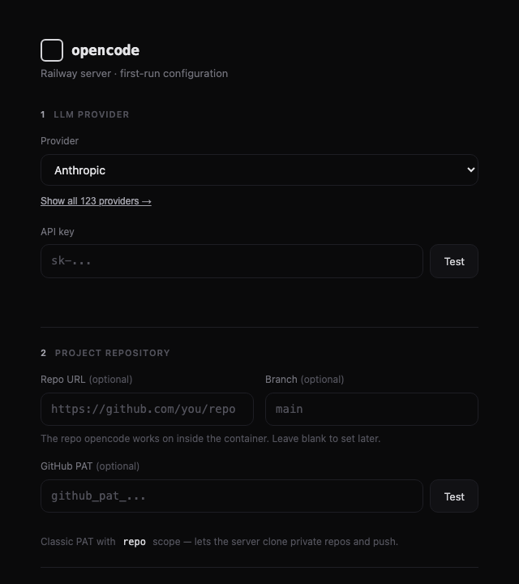
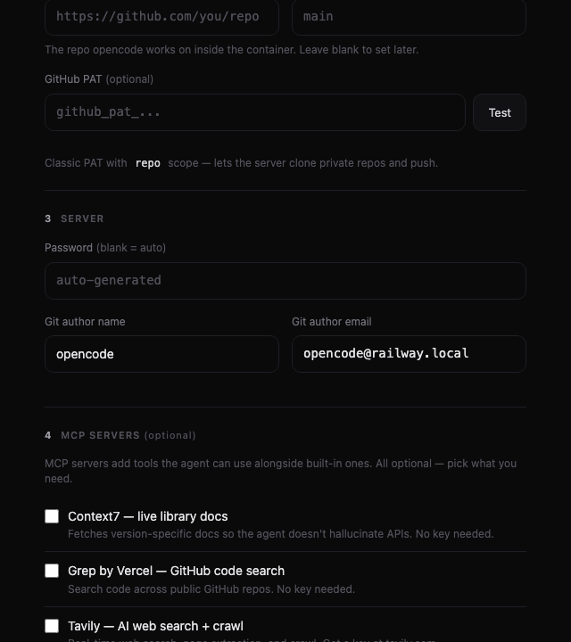
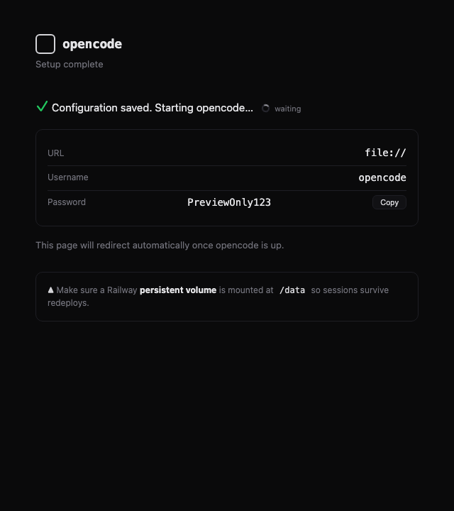

# opencode on Railway

Deploy [opencode](https://opencode.ai) as a persistent server on Railway so your
AI coding sessions keep running even when your laptop shuts down. Reconnect from
your browser or terminal at any time.

- **First-run setup wizard** — open the Railway domain, pick your LLM provider,
  paste a key, point it at a repo, and go. No CLI required.
- **Persistent sessions** — state lives on a Railway volume at `/data`, so chats,
  auth, and the cloned project survive redeploys.
- **Any provider** — Anthropic, OpenAI, OpenRouter, OpenCode Zen, DeepSeek, Groq,
  xAI, and more, plus a custom option for anything OpenAI-compatible. The provider
  catalog is sourced from [models.dev](https://models.dev) at runtime.
- **MCP servers** — a bundled local **toolkit** MCP on by default (calculator,
  dates, text, IDs, unit conversion, semver, network, color — no key needed), plus
  opt-in checkboxes for Context7 (live docs), Grep (GitHub code search), Tavily/Exa
  (web search), Memory, Sequential Thinking, Fetch, Brave Search, and custom remote
  MCP URLs. All configurable from the wizard.
- **Agent skills** — opt-in starter pack (diagnose, git-commit-hygiene, pr-review,
  environment-briefing) seeded to the persistent volume and discoverable by the
  agent via the `skill` tool.
- **Secured by default** — set a login password on first run; the manager logs
  you in once and injects opencode's auth behind the scenes. Container runs as a
  non-root user.
- **Reconfigurable in-browser** — open `/setup` on your running server to edit
  provider, keys, MCPs, or repo. No restart, no env vars.
- **Managed runtime** — a built-in manager supervises `opencode web`, reverse-
  proxies traffic, and exposes a dashboard at `/manage` (status, logs, restart,
  key revalidate/rotate).

[](https://railway.com/deploy/opencode-wizard)

> ### 💡 Just click Deploy — no variables required
> Every Railway template variable is **optional**. If you leave them all blank,
> the first-run **setup wizard** launches on your Railway domain and walks you
> through setting a login password, picking a provider, pasting a key, and
> (optionally) pointing at a repo. Set variables up front only if you want to
> skip the wizard.

> ### Add a `/data` volume after deploy — required for persistence
> Railway templates can't auto-create volumes. After deploying, add a persistent
> volume mounted at **`/data`** (service **Settings → Volumes**), or sessions,
> auth, and the cloned repo won't survive redeploys. The setup wizard also shows
> a red banner if it can't detect one.

**One-click template:** <https://railway.com/deploy/opencode-wizard>

---

## Deploy

### Option A — Deploy from this repo

1. Fork or push this repo to your GitHub.
2. In Railway: **New Project → Deploy from GitHub repo** → select it. Railway
   auto-detects the `Dockerfile` and `railway.json`.
3. **Add a persistent volume**: service **Settings → Volumes → Add Volume**,
   mount path **`/data`** (this is what makes sessions survive redeploys).
4. (Optional) Set variables up front to skip the wizard — see below.
5. Deploy. Open the generated `*.up.railway.app` domain:
   - If you didn't set variables, the **setup wizard** appears. Fill it in once.
   - If you did, log in as `opencode` with your `OPENCODE_SERVER_PASSWORD`.

### Option B — One-click Railway template

This repo is published as a Railway template. No variables are required — the
wizard handles everything on first run.

**Deploy:** <https://railway.com/deploy/opencode-wizard>

Maintainer notes for the template composer (which variables to expose, what to
pre-fill, what **not** to add) live in
[`TEMPLATE_VARIABLES.md`](./TEMPLATE_VARIABLES.md).

> The volume at `/data` still needs to be added after deploy (Railway templates
> don't auto-create volumes). The setup wizard's success page reminds users of this.

---

## First-run setup wizard

When the container boots with no server password in the environment,
`wizard.py` serves a one-page web UI on the Railway domain. Five sections;
the password and provider + key are required, the rest optional:

| Step | Field | Required | Notes |
|---|---|---|---|
| 1 · Provider | LLM provider | yes | Sourced from [models.dev](https://models.dev). Anthropic, OpenAI, OpenRouter, OpenCode Zen, DeepSeek, Groq, xAI, and many more, or custom OpenAI-compatible. |
| 1 · Provider | API key | yes | Validated live against the provider's API. Stored to `/data/.setup.env` (chmod 600). |
| 1 · Provider | Model id | custom only | Required for custom endpoints (opencode won't know their models). Known providers: pick a model with `/models` after start. |
| 2 · Repo | Repo URL + branch | no | Cloned into `/data/repo`. Set later if you like. |
| 2 · Repo | GitHub PAT | no | Classic PAT with `repo` scope for private repos / pushing. Validated live. |
| 3 · Server | Password | no | Basic-auth password for `opencode`. Auto-generated if blank. |
| 3 · Server | Git identity | no | Name + email for commits. Defaults to `opencode`. |
| 4 · MCP | MCP servers | no | The bundled Toolkit MCP is shown as always-on (disable with `DISABLE_TOOLKIT_MCP=1`). Opt-in checkboxes for Context7, Grep, Tavily, Exa, Memory, Sequential Thinking, Fetch, Brave Search. API-key MCPs get a live Test button. Add custom remote MCPs by URL. |
| 5 · Skills | Agent skills | no | Checkboxes for the starter skill pack. Selected skills are seeded to `/data/.config/opencode/skills/`. |





On submit, settings persist to `/data/.setup.env` (chmod 600). The manager then
reloads them, re-runs `prep.sh` (which calls `generate_config.py` to write
`/data/opencode.json` with the model + MCP block, seeds the opt-in skills to the
volume, seeds a global `AGENTS.md` — versioned re-seed, user edits preserved;
see [`seed_agents.py`](./seed_agents.py) — and clones/pulls `GIT_REPO`), and
starts `opencode web` as a child on an internal port — without restarting the
container. You're logged in automatically and redirected to the opencode UI.

---

## MCP servers

### Bundled toolkit (on by default)

A pure-Python local MCP server — `mcps/toolkit.py` — ships in the image and is
enabled out-of-the-box. No key, no network, no `npx` download. It exposes eight
tools to the agent (surfaced as `toolkit_<name>`):

| Tool | What it does |
|---|---|
| `toolkit_calculate` | Safe expression eval (full `math`/`statistics`, constants π/e/τ/φ/g/c/h/k/Nₐ/R, `**`/`^` power), base conversion, statistics, primes, `fib`. |
| `toolkit_datetime` | `now`/`convert`/`parse`/`format` in any IANA zone, unix↔ISO, business days, duration parse/humanize, calendar info. |
| `toolkit_text` | Case transforms (camel/snake/kebab/slug), encode/decode (base64/32/58/hex/url/rot13), hash + HMAC, regex, line diff, JSON pretty/validate, JWT decode, Levenshtein. |
| `toolkit_generate_id` | UUID v1/3/4/5, ULID, nanoid, `secrets` tokens, password generator, random choice/sample/shuffle. |
| `toolkit_convert_units` | Length, mass, temperature (offset-aware), data size, speed, angle, pressure, volume, area, time, fuel. |
| `toolkit_semver` | Parse / compare / bump / `satisfies(range)` (with `^`, `~`, `||`, `*`) / sort / `max_satisfying`. |
| `toolkit_network` | IP + CIDR info, ip-in-cidr, URL parse/build/resolve/encode, query parse. |
| `toolkit_color` | hex↔rgb↔hsl, contrast ratio, luminance, complementary, mix, lighten/darken, random. |

Disable it with `DISABLE_TOOLKIT_MCP=1`. Run `python3 mcps/_selftest.py` to
verify the server (90 stdio test cases over the MCP handshake).

### Opt-in preset MCPs

The wizard offers a catalog of preset MCP servers (Step 4), all opt-in:

| MCP | Type | Key needed | What it does |
|---|---|---|---|
| Context7 | remote | no | Live version-specific library docs — kills hallucinated APIs. |
| Grep by Vercel | remote | no | Search code across public GitHub repos. |
| Tavily | remote | yes | AI web search, page extraction, and crawl. |
| Exa | remote | yes | AI-powered semantic web search. |
| Memory | local (npx) | no | Persistent knowledge graph across sessions. |
| Sequential Thinking | local (npx) | no | Structured reasoning chains for hard problems. |
| Fetch | local (npx) | no | Web page fetching → clean markdown. |
| Brave Search | local (npx) | yes | Privacy-focused web search. Free tier: 2k queries/mo. |

You can also add **custom remote MCPs** by name + URL + optional auth header.

Local MCPs run in-container via `npx` (Node.js 20 LTS is included in the image).
The npx cache lives on `/data` so downloads are kept across redeploys.

MCP config is written to `/data/opencode.json` by `generate_config.py` on every
boot, using `{env:VAR}` substitution so API keys stay in the environment, not in
the JSON file. MCPs whose required key is missing are silently skipped.

To add an MCP after setup, either reconfigure (below) or edit `opencode.json`
directly — opencode merges project config with the custom config file.

---

## Agent skills

The wizard offers a starter pack of skills (Step 5), all opt-in:

| Skill | What it does |
|---|---|
| `environment-briefing` | Railway container context — `/data` layout, env vars, commit & push with the injected GitHub PAT (and safe ways to introspect it), reconnect, available MCPs/skills. |
| `diagnose` | Disciplined debug loop: reproduce → minimise → hypothesise → instrument → fix → regression-test. |
| `git-commit-hygiene` | Clean conventional commit messages and proper staging. |
| `pr-review` | Review changes against documented standards and the originating spec. |

Selected skills are seeded to `/data/.config/opencode/skills/` on every boot.
Bundled skills are overwritten so selection stays accurate and image updates
apply; user-created skills (different names) are never touched. To keep a
customised copy of a bundled skill, copy + rename it.

Skills are loaded on-demand by the agent via the native `skill` tool — they
don't consume context until invoked.

---

## Reconfiguring

Open `/setup` on your running server to reconfigure. You'll be asked to log in
(with the password set on first run), then the same setup form loads — pre-
filled from your existing `/data/.setup.env`. On save the manager rewrites that
file, re-runs `prep.sh`, and restarts the `opencode web` child to pick up the
new settings. No Railway variable changes and no container restart needed. Your
volume data (sessions, repo, auth) is preserved.

A dashboard is also available at `/manage` (status, recent logs, and a restart
button). The `RECONFIGURE` env var from earlier template versions is no longer
needed — reconfiguring is now an in-browser action.

---

## Configuration

All config is optional — leave it blank and use the wizard, or set Railway
variables to go straight to opencode.

| Variable | Purpose |
|---|---|
| `OPENCODE_SERVER_PASSWORD` | Basic-auth password (user is always `opencode`). Set via the wizard on first run, or set this (and a provider key) up front to skip the wizard. |
| `OPENCODE_MODEL` | `provider/model-id`. Optional — leave unset and pick a model via `/models` in the web UI. Required for custom providers (`custom/<model-id>`). |
| `OPENCODE_SMALL_MODEL` | Cheaper model for titles/summaries. Optional — opencode auto-selects a small model when available. |
| `GIT_REPO` | Repo the agent clones into `/data/repo` and works on. |
| `GIT_REPO_BRANCH` | Branch to checkout (default: repo default). |
| `GITHUB_TOKEN` | Classic PAT injected into the clone URL for private repos + pushes. |
| `GIT_USER_NAME` / `GIT_USER_EMAIL` | Git identity for commits (default `opencode`). |
| `RECONFIGURE` | Obsolete — reconfigure in-browser at `/setup` instead. Accepted for backward compatibility but ignored. |
| `ENABLED_MCPS` | Comma-separated MCP IDs to enable (e.g. `context7,gh_grep,tavily`). |
| `DISABLE_TOOLKIT_MCP` | Set to `1` to turn off the bundled toolkit MCP (on by default). |
| `ENABLED_SKILLS` | Comma-separated skill names to seed (e.g. `diagnose,pr-review`). |
| `MCP_CUSTOM` | JSON array of custom remote MCPs: `[{"name":"...","url":"...","headers":{...}}]`. |
| `TAVILY_API_KEY` | Tavily MCP key (if `tavily` in `ENABLED_MCPS`). |
| `EXA_API_KEY` | Exa MCP key (if `exa` in `ENABLED_MCPS`). |
| `BRAVE_API_KEY` | Brave Search MCP key (if `brave_search` in `ENABLED_MCPS`). |
| `<PROVIDER>_API_KEY` | Provider API key — env var name comes from [models.dev](https://models.dev). Common ones: `ANTHROPIC_API_KEY`, `OPENAI_API_KEY`, `OPENROUTER_API_KEY`, `OPENCODE_API_KEY`, `DEEPSEEK_API_KEY`, `GROQ_API_KEY`, `XAI_API_KEY`. |

> **Note:** opencode works on the copy of your repo **inside the container**
> (at `/data/repo`), not the files on your laptop. Sync changes back via git —
> the agent can commit & push, or you pull from its branch.

---

## Reconnect from your laptop

```bash
# Browser
open https://<your-app>.up.railway.app   # log in: opencode / <password>

# Terminal (TUI over the remote server)
opencode attach https://<your-app>.up.railway.app -p <password>
```

Sessions live on the `/data` volume, so they survive redeploys and your laptop
shutting down.

---

## How it works

```
Railway deploy
   └─ entrypoint.sh
        ├─ sh /prep.sh                         # load .setup.env, git identity, generate_config,
        │                                      # seed skills + AGENTS.md, clone/pull GIT_REPO
        └─ exec python3 wizard.py --manage     # the manager owns $PORT (PID 1)
              ├─ configured? (OPENCODE_SERVER_PASSWORD set)
              │     no  → serve /setup (first-run form, no auth)
              │     yes → start `opencode web` child on 127.0.0.1:(PORT+1); serve /manage
              ├─ /setup  (POST) → write .setup.env, re-run prep.sh, (re)start child, auto-login
              ├─ /manage/*      → dashboard / logs / restart  (session auth)
              └─ everything else → reverse-proxy to the opencode child (basic auth injected)
```

`/data` layout:
```
/data
├── .setup.env                     # wizard output (chmod 600, secrets here)
├── opencode.json                  # model + mcp block (written by generate_config.py)
├── repo/                          # cloned project the agent works on
├── .config/opencode/
│   ├── skills/                    # seeded agent skills (opt-in)
│   ├── AGENTS.md                  # always-in-context environment briefing
│   └── .AGENTS.md.bundled.sha256  # hash sidecar — lets bundled AGENTS.md updates reach existing deploys safely
└── .local/share/opencode/         # sessions, auth, snapshots (opencode's $HOME)
```

---

## License

MIT — see [LICENSE](./LICENSE).

Built on [opencode](https://opencode.ai) by [Anomaly](https://anoma.ly).
opencode is © its respective contributors; this repo ships a deployment wrapper
and first-run wizard and is licensed independently under MIT.
